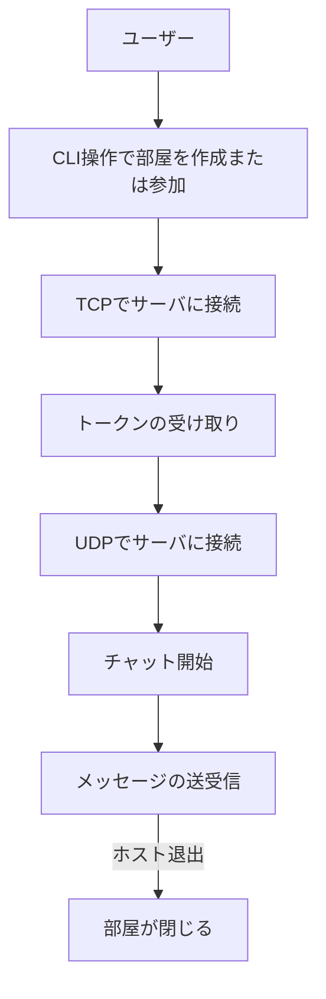

# チャットメッセンジャーシステム (Stage 2)

## 概要
このプロジェクトは、クライアントが自分でチャットルームをホストし、他のユーザーを招待してリアルタイムでチャットができるCLIベースのメッセージングシステムです。  
TCPを使用してチャットルームの作成と接続を管理し、UDPを使用して効率的にメッセージを中継します。

## 特徴
- **チャットルームの作成と参加**  
  ユーザーは新しいチャットルームを作成するか、既存のチャットルームに参加できます。  
  パスワード保護されたルームにも対応。
  
- **リアルタイムチャット**  
  UDPプロトコルを使用して、高速かつ効率的にメッセージを配信。
  
- **CLIベースの操作**  
  シンプルで軽量なインターフェースを提供。

- **セキュリティ**  
  トークン認証により、ユーザーごとのアクセス権を管理。

## このプロジェクトを通して学べること
1. **ネットワークプログラミング**  
   - TCPとUDPプロトコルの違いとその実践的な使用方法。
   - ソケットプログラミングの基本操作。
  
2. **プロトコル設計**  
   - カスタムプロトコル（TCRP）の設計と実装。
   - ヘッダーとペイロードを分けたデータ構造設計。

3. **リアルタイムシステム構築**  
   - 非同期通信とスレッドの活用。
   - 大量のデータを効率的に処理する仕組み。

4. **システム設計**  
   - シンプルでスケーラブルなアーキテクチャ設計。
   - トークン管理を利用したセッション制御。

以下にシステムの全体フローを表したアクティビティ図を示します。



## 必要条件
- Python 3.9以上
- 推奨OS: Linux, macOS, Windows
- 必要なPythonパッケージ: 標準ライブラリで動作（追加ライブラリは `requirements.txt` を参照）

## インストール手順
```bash
# 1. リポジトリをクローン
git clone https://github.com/your-repo/chat-messenger-stage2.git
cd chat-messenger-stage2

# 2. 依存関係をインストール
pip install -r src/requirements.txt

# 3. サーバの起動
python src/server.py

# 4. クライアントの起動
python src/client.py
```

## 使用方法
1. クライアントを起動し、以下の操作を行います。
   - `create` コマンドで新しいチャットルームを作成。
   - `join` コマンドで既存のチャットルームに参加。

2. メッセージを送信:
   - CLIでメッセージを入力することで、他の参加者に配信されます。

3. チャットを終了するには、`exit` を入力します。

## 機能一覧
- チャットルームの作成と参加
- トークンを利用した認証とセキュリティ
- メッセージのリアルタイム送受信
- UDP通信を利用した効率的なメッセージ配信

## 技術スタック
- **プログラミング言語**: Python 3.9+
- **プロトコル**: TCP, UDP
- **CLI操作**: 標準入力と出力を使用した軽量インターフェース
- **トークン認証**: カスタムトークンシステム

## 追加資料
- アーキテクチャ図、シーケンス図などは `project/diagrams` ディレクトリを参照してください。

## 貢献方法
1. このリポジトリをフォーク。
2. 新しいブランチを作成。
   ```bash
   git checkout -b feature/your-feature
   ```
3. 変更をコミット。
   ```bash
   git commit -m "Add your changes"
   ```
4. プルリクエストを送信。

## ライセンス
このプロジェクトは [MIT ライセンス](LICENSE) の下で提供されています。
