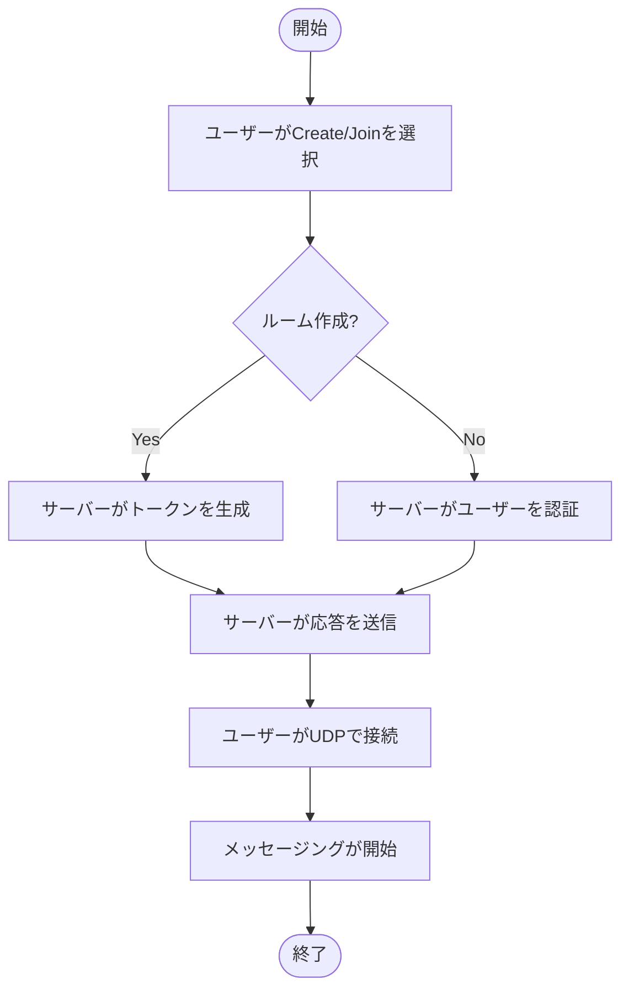
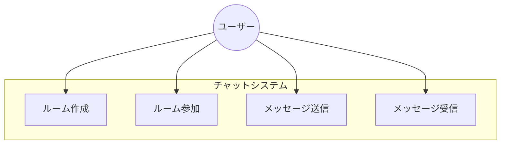
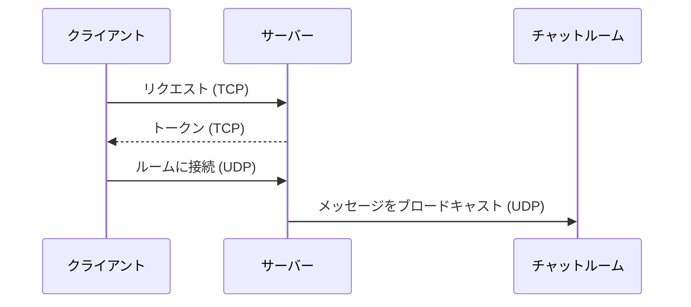
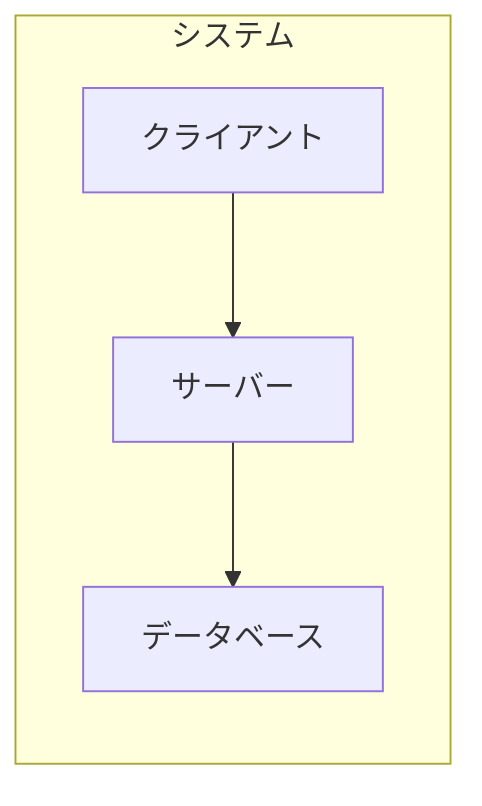
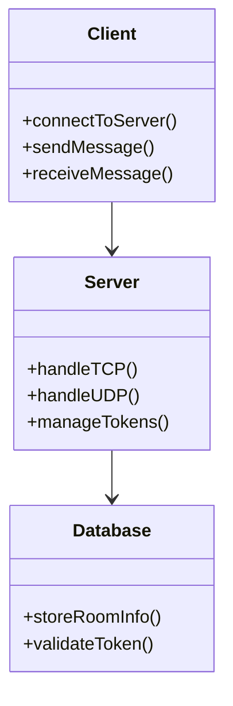
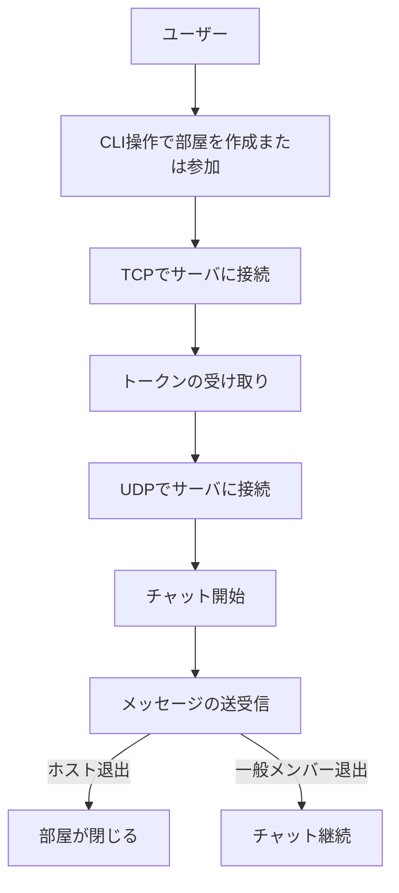
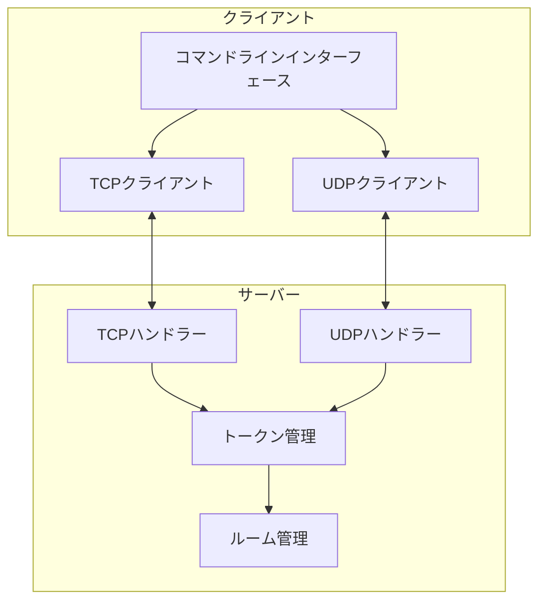

# チャットシステム設計図

## アクティビティ図

```mermaid
flowchart TD
    Start([開始]) --> UserSelect[ユーザーがCreate/Joinを選択]
    UserSelect --> ifCreate{ルーム作成?}
    ifCreate -->|Yes| GenerateToken[サーバーがトークンを生成]
    ifCreate -->|No| Authenticate[サーバーがユーザーを認証]
    GenerateToken --> Response[サーバーが応答を送信]
    Authenticate --> Response
    Response --> UDPConnect[ユーザーがUDPで接続]
    UDPConnect --> Messaging[メッセージングが開始]
    Messaging --> End([終了])
```

## ユースケース図

```mermaid
flowchart TD
    User((ユーザー))
    subgraph ChatSystem[チャットシステム]
        Create[ルーム作成]
        Join[ルーム参加]
        Send[メッセージ送信]
        Receive[メッセージ受信]
    end
    User --> Create
    User --> Join
    User --> Send
    User --> Receive
```

## シーケンス図

```mermaid
sequenceDiagram
    participant Client as クライアント
    participant Server as サーバー
    participant Room as チャットルーム
    
    Client->>Server: リクエスト (TCP)
    Server-->>Client: トークン (TCP)
    Client->>Server: ルームに接続 (UDP)
    Server->>Room: メッセージをブロードキャスト (UDP)
```

## コンポーネント図

```mermaid
flowchart LR
    subgraph System[システム]
        Client[クライアント]
        Server[サーバー]
        Database[データベース]
    end
    
    Client --> Server
    Server --> Database
```

## クラス図

```mermaid
classDiagram
    class Client {
        +connectToServer()
        +sendMessage()
        +receiveMessage()
    }
    
    class Server {
        +handleTCP()
        +handleUDP()
        +manageTokens()
    }
    
    class Database {
        +storeRoomInfo()
        +validateToken()
    }
    
    Client --> Server
    Server --> Database
```

## チャット処理フロー

```mermaid
flowchart TD
    A[ユーザー] --> B[CLI操作で部屋を作成または参加]
    B --> C[TCPでサーバに接続]
    C --> D[トークンの受け取り]
    D --> E[UDPでサーバに接続]
    E --> F[チャット開始]
    F --> G[メッセージの送受信]
    G -->|ホスト退出| H[部屋が閉じる]
    G -->|一般メンバー退出| I[チャット継続]
```

## 全体システム構成

```mermaid
flowchart TB
    subgraph Client[クライアント]
        CLI[コマンドラインインターフェース]
        TCPClient[TCPクライアント]
        UDPClient[UDPクライアント]
    end
    
    subgraph Server[サーバー]
        TCPHandler[TCPハンドラー]
        UDPHandler[UDPハンドラー]
        TokenManager[トークン管理]
        RoomManager[ルーム管理]
    end
    
    CLI --> TCPClient
    CLI --> UDPClient
    TCPClient <--> TCPHandler
    UDPClient <--> UDPHandler
    TCPHandler --> TokenManager
    UDPHandler --> TokenManager
    TokenManager --> RoomManager
```